# Relatório Técnico - SAJ-OPC16: Sistema IoT de Gestão de Recursos Compartilhados

## 1. Introdução

Este documento detalha a arquitetura e implementação do projeto SAJ-OPC16, um sistema de Internet das Coisas (IoT) para a gestão de recursos compartilhados. A plataforma permite que usuários cadastrados reservem, utilizem e liberem recursos (como equipamentos de laboratório, salas ou veículos) de forma remota e automatizada.

O sistema é composto por uma aplicação web (Frontend), uma API REST (Backend), um banco de dados e simuladores de dispositivos IoT, todos orquestrados em um ambiente containerizado com Docker. A solução visa otimizar o uso de recursos, fornecer um controle de acesso seguro e gerar dados para análise de utilização.

- **Link para o repositório:** [Link para o Repo](https://github.com/IfKaioTavares/topicos_avancados_web2_atvf)

## 2. Diagramas UML

A seguir são apresentados os diagramas que modelam o sistema, seus atores, funcionalidades e fluxos de dados.

### 2.1. Diagrama de Casos de Uso

O diagrama abaixo ilustra as interações dos atores (Usuário e Administrador) com as principais funcionalidades do sistema.

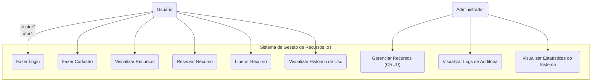

### 2.2. Diagrama de Classes (Modelo de Domínio)

Este diagrama representa as principais entidades do sistema e seus relacionamentos.

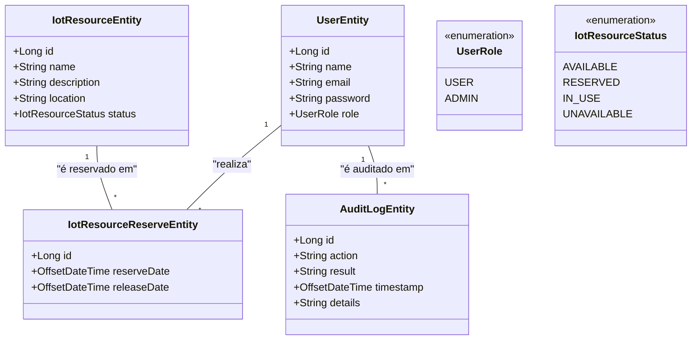

### 2.3. Diagrama de Sequência (Fluxo de Reserva de Recurso)

O diagrama a seguir detalha o fluxo de interação entre os componentes do sistema quando um usuário realiza a reserva de um recurso.

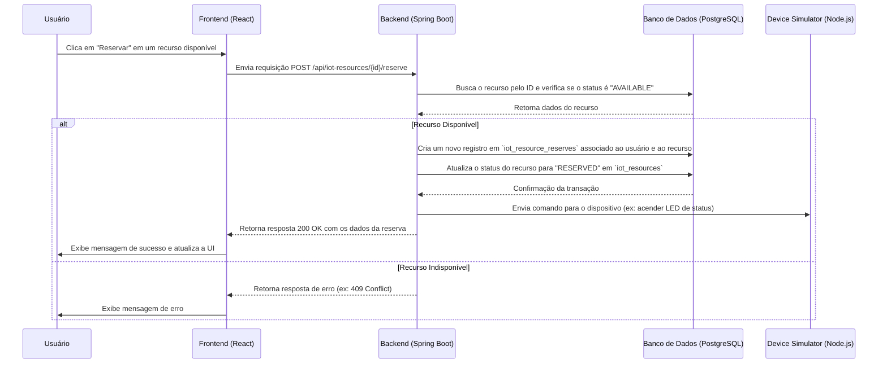

## 3. Relatório Técnico

### 3.1. Arquitetura da Solução

A arquitetura do sistema é baseada em microsserviços containerizados, orquestrados com Docker Compose.

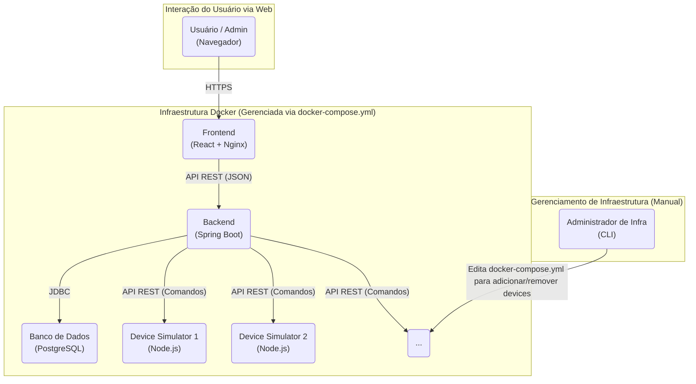

**Descrição do Funcionamento:**

-   **Frontend:** É uma Single-Page Application (SPA) desenvolvida com **React** e estilizada com **CSS**. Ela é responsável por toda a interface do usuário, adaptando as funcionalidades visíveis com base no papel (role) do usuário autenticado (Usuário ou Administrador). Após o build, os arquivos estáticos são servidos por um container **Nginx**.
-   **Backend:** É uma API RESTful desenvolvida com **Java** e **Spring Boot**. Ele centraliza todas as regras de negócio: autenticação e autorização de usuários, gerenciamento de recursos, lógica de reservas, auditoria e coleta de estatísticas.
-   **Banco de Dados:** Utiliza **PostgreSQL** para persistir todos os dados da aplicação.
-   **Device Simulator:** É um serviço em **Node.js** que simula um dispositivo IoT. Cada instância representa um dispositivo físico. **A adição de um novo dispositivo ao ecossistema é uma tarefa manual de infraestrutura**, que consiste em adicionar uma nova definição de serviço para o simulador no arquivo `docker-compose.yml`.
-   **Docker Compose:** Orquestra todos os serviços, facilitando o deploy e a execução de todo o ambiente com um único comando.

### 3.2. Modelo de Dados

O modelo de dados relacional foi implementado no PostgreSQL e é gerenciado através de migrações com **Flyway**. A imagem abaixo apresenta o Diagrama de Entidade-Relacionamento (DER) do banco de dados, ilustrando as tabelas e suas chaves primárias e estrangeiras.

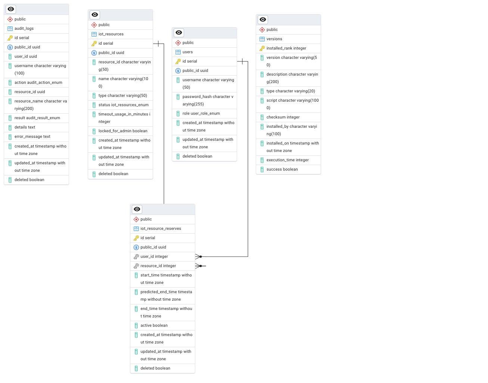

-   **`users`:** Tabela que armazena os dados dos usuários.
-   **`iot_resources`:** Tabela com o catálogo de recursos compartilhados.
-   **`iot_resource_reserves`:** Tabela de associação que representa o histórico de reservas.
-   **`audit_logs`:** Tabela para fins de auditoria e rastreabilidade.

### 3.3. Casos de Uso e Telas do Sistema

-   **Cadastro e Autenticação:** Usuários se cadastram e fazem login através de formulários simples e intuitivos. O Backend valida os dados e retorna um token JWT para autenticação.

    *Tela de Login*
    

    *Tela de Cadastro*
    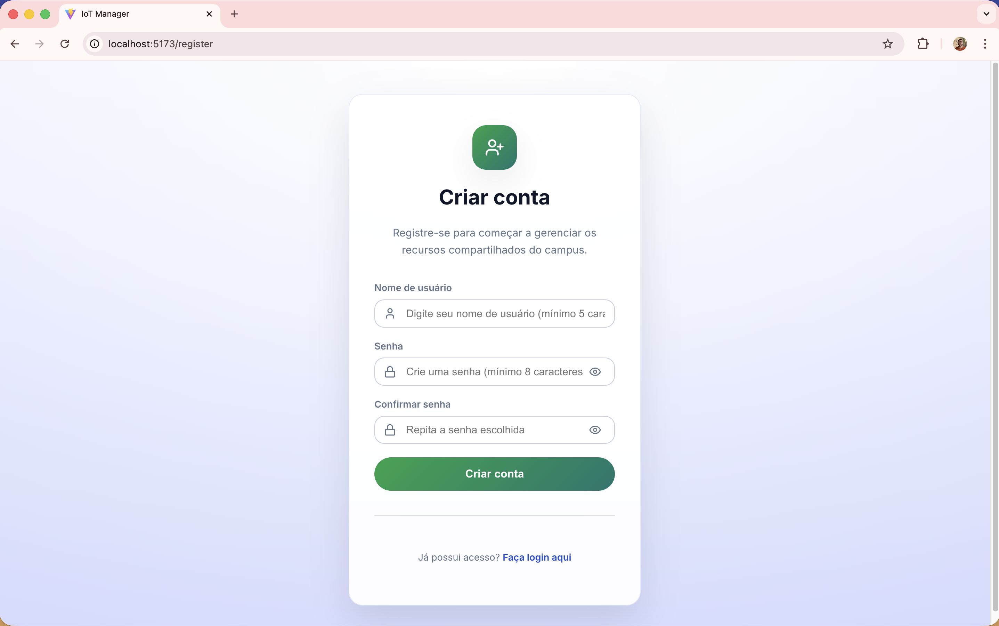

-   **Visualização e Reserva de Recursos:** Após o login, o usuário acessa a página principal, onde pode ver a lista de recursos e seu status em tempo real. A interface indica claramente quais recursos estão disponíveis, ocupados ou indisponíveis.

    *Tela Principal com Recursos*
    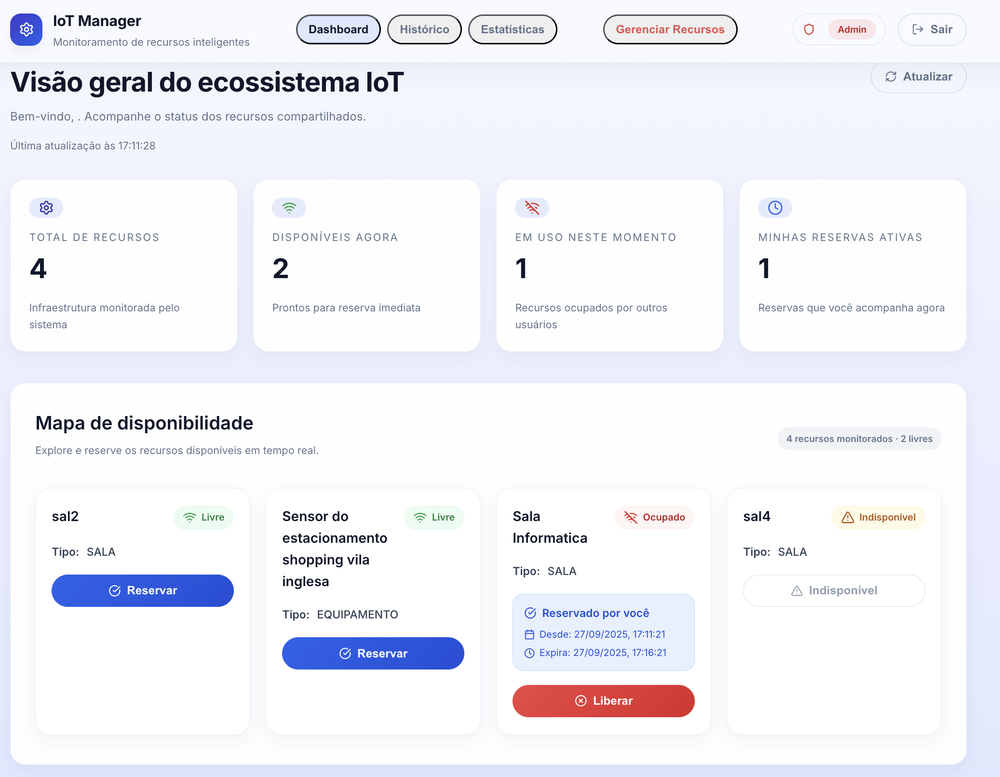

    *Exemplo de Recurso Ocupado*
    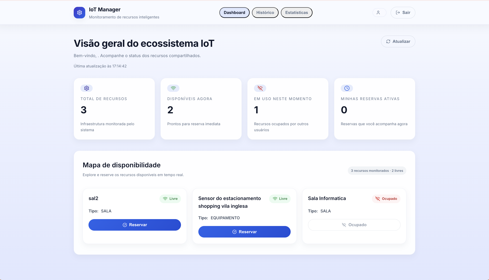

-   **Gestão de Recursos (Admin):** O administrador tem acesso a páginas exclusivas para gerenciar os recursos, podendo cadastrar, editar e visualizar todos os itens do sistema.

    *Página de Gerenciamento de Recursos (Visão do Admin)*
    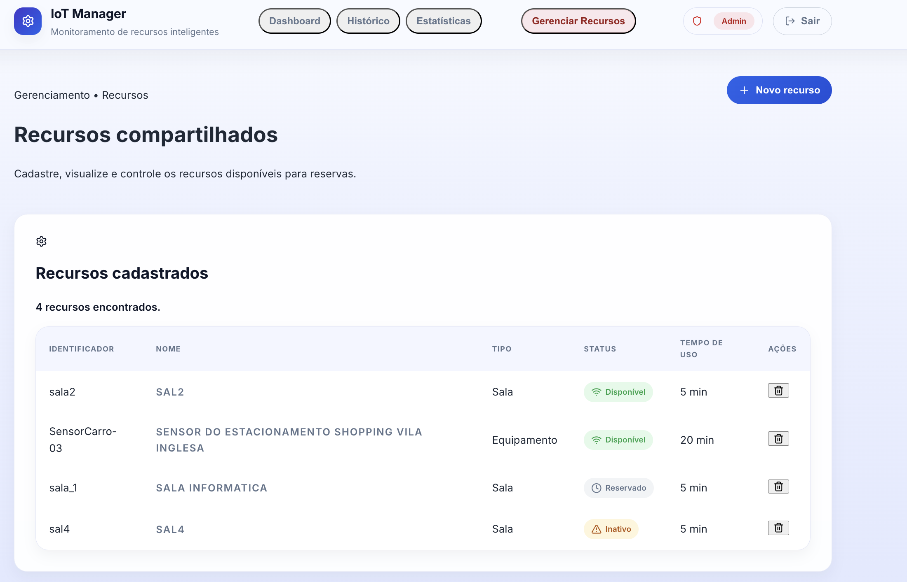

    *Formulário de Cadastro de Novo Recurso*
    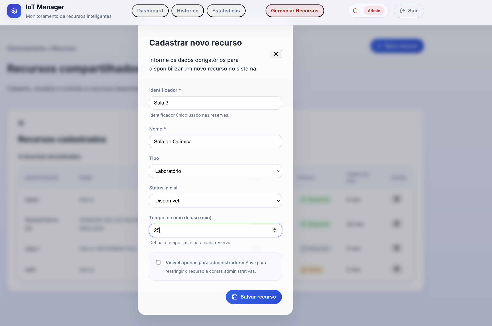

-   **Auditoria e Histórico:** Usuários comuns podem ver seu histórico de reservas. Administradores possuem uma visão mais completa dos logs do sistema.

    *Tela de Histórico de Reservas do Usuário*
    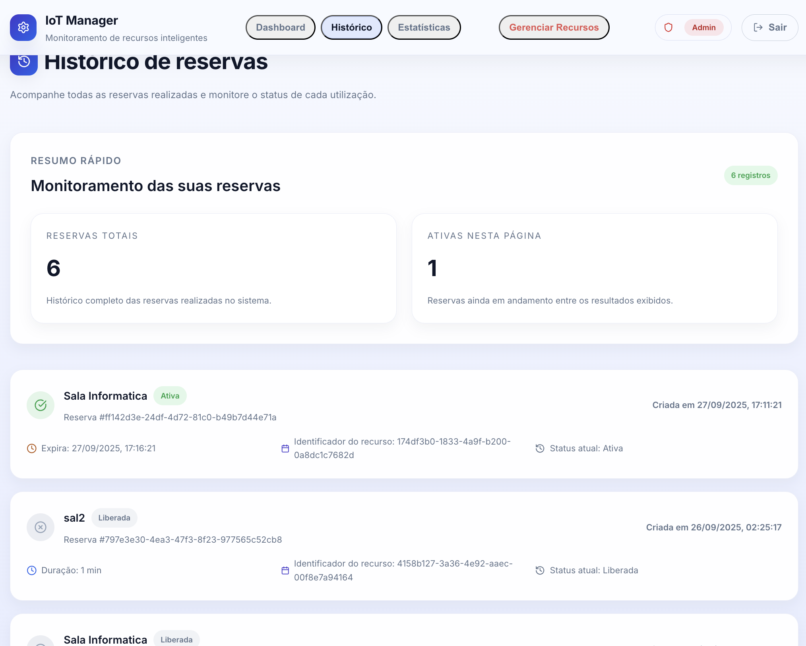

### 3.4. Monitoramento e Logs

O sistema foi configurado para gerar logs detalhados, tanto a nível de aplicação (auditoria) quanto de infraestrutura (containers), permitindo um monitoramento eficaz e facilitando a depuração de problemas.

- **Logs da Aplicação:** O Backend registra eventos importantes. A imagem abaixo mostra o log gerado pelo *scheduler* que cancela e libera uma reserva automaticamente após o tempo limite de uso expirar.

    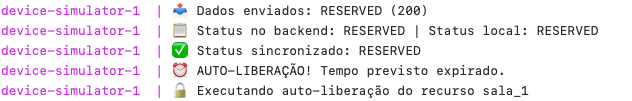

- **Logs dos Containers:** É possível inspecionar os logs de cada serviço individualmente usando o Docker, o que é essencial para o diagnóstico de problemas de infraestrutura.

    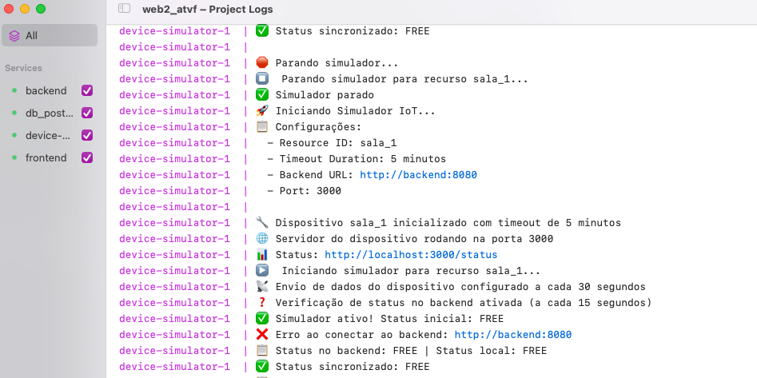

### 3.5. Tecnologias Utilizadas

-   **Backend:**
    -   Java 21
    -   Spring Boot 3
    -   Spring Data JPA (Hibernate)
    -   Spring Security (com JWT)
    -   PostgreSQL Driver
    -   Flyway (para migrações de banco de dados)
    -   Maven (gerenciador de dependências)
-   **Frontend:**
    -   JavaScript
    -   React 18
    -   Vite (build tool)
    -   Tailwind CSS (framework de estilização)
    -   Axios (cliente HTTP)
-   **Simulador de Dispositivo:**
    -   Node.js
    -   Express.js
-   **Infraestrutura e DevOps:**
    -   Docker
    -   Docker Compose
    -   Nginx (para servir o frontend)

### 3.6. Instruções de Setup e Execução

1.  **Pré-requisitos:** Docker e Docker Compose instalados.
2.  **Clone o repositório:** `git clone <url-do-repositorio>`
3.  **Navegue até a raiz do projeto:** `cd web2_atvf`
4.  **Inicie os serviços:** Execute o comando `docker-compose up -d --build`. Este comando irá construir as imagens Docker para cada serviço e iniciá-los em background.
5.  **Acesse a aplicação:**
    -   O **Frontend** estará disponível em `http://localhost:5173`.
    -   A documentação da **API Backend** (Swagger UI) estará disponível em `http://localhost:8080/swagger-ui.html`.

**Nota sobre a Simulação:** Para adicionar um novo dispositivo IoT simulado, é necessário editar o arquivo `docker-compose.yml` manualmente. Copie e cole a definição de um serviço `device-simulator` existente, alterando o nome do serviço (ex: `device-simulator-3`) e o mapeamento de portas para evitar conflitos (ex: `"8083:3000"`). Após salvar o arquivo, execute `docker-compose up -d --build` novamente para iniciar o novo simulador.

## 4. Funcionalidades Bônus Implementadas

-   **Notificações em Tempo Real (Backend Push):** O frontend atualiza o status dos recursos em tempo real. O backend, ao receber uma atualização de estado de um dispositivo (seja por ação do usuário ou outro meio), proativamente envia essa informação para os clientes conectados. Isso garante que todos os usuários vejam o status mais recente de um recurso sem a necessidade de recarregar a página.
-   **Página de Estatísticas Agregadas:** Foi criada uma tela, acessível apenas por administradores, que consulta o backend para exibir um dashboard com dados consolidados sobre a saúde e utilização do sistema, como número de usuários cadastrados, total de recursos por status (`AVAILABLE`, `RESERVED`, etc.) e o número total de reservas já efetuadas.

    *Tela de Estatísticas (Visão do Admin)*
    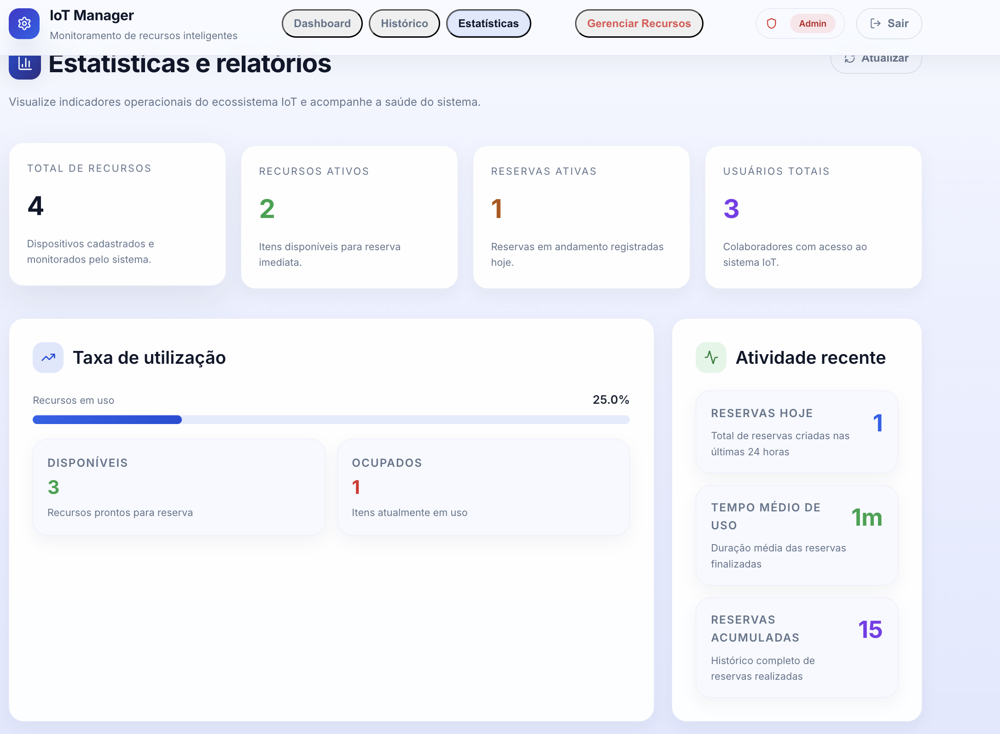
